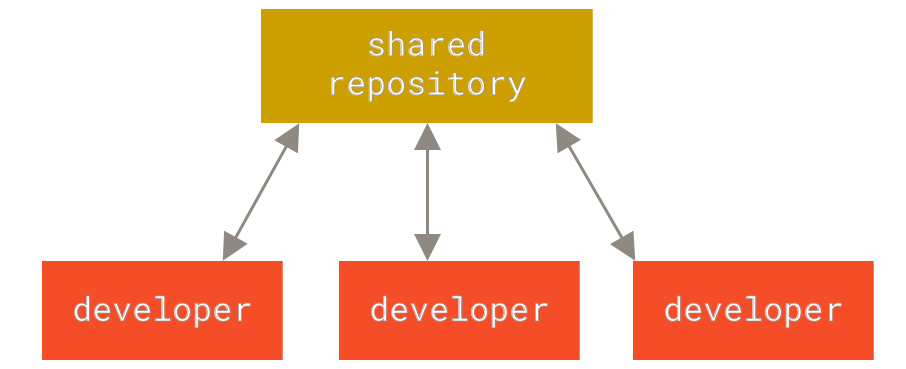
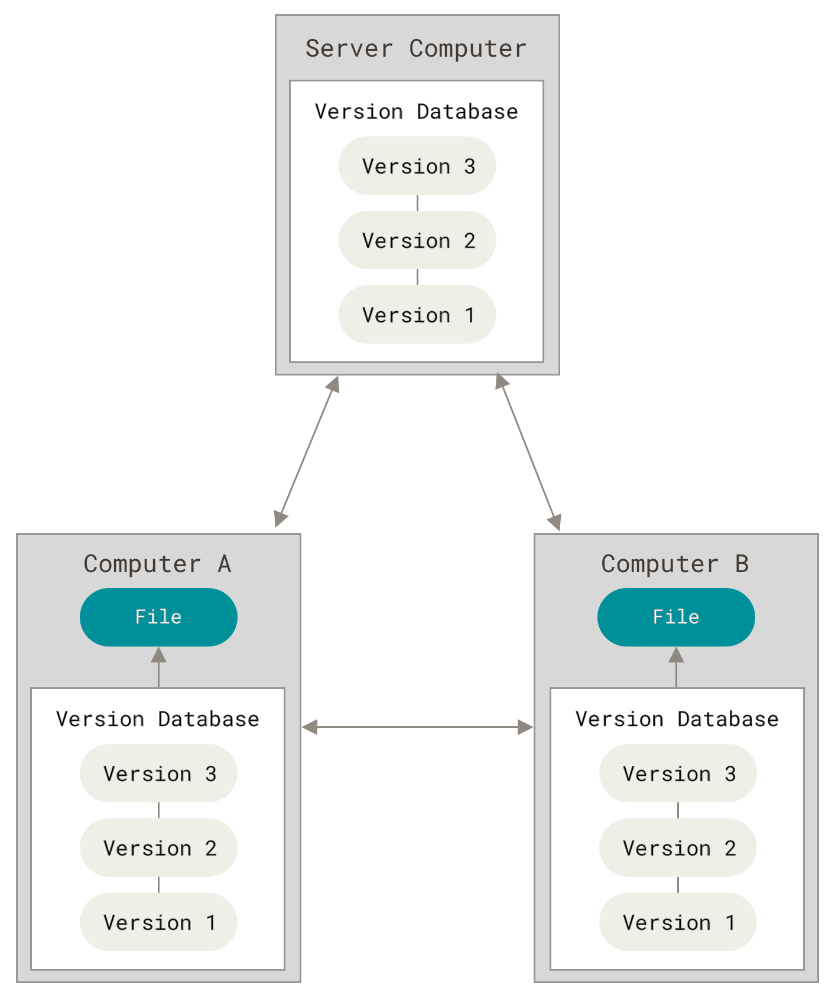
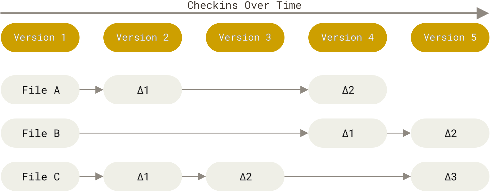
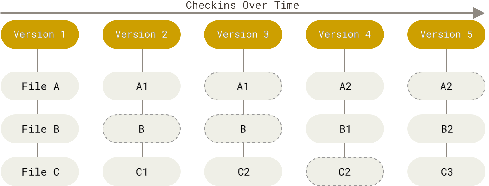
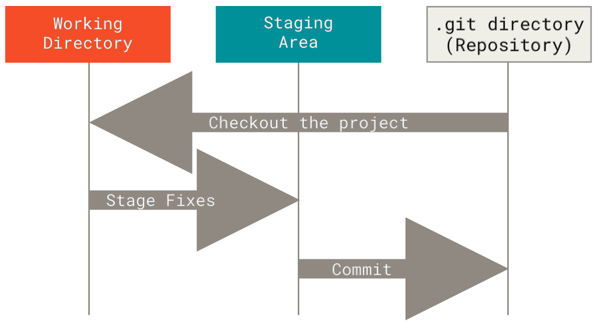

# Getting Started

## About Version Control
`Version Control` - A system that records changes to a file or set of files over time so that you can recall a specific version later

	### Centralised VCS

- Examples of Centralised VCS - CVS, Subversion, Perforce
- A single server that contains all the versioned files, and a number of clients that check out files from that central place
- Single point of failure

### Distributed VCS
- Examples of Distributed VCS - Git, Mercurial, Darcs
- Fully mirror the repository, including its full history
- Every clone is a full backup


## Short History of Git
- 2005 - Linux Torvalds develop Git in 5 days
- Git stands for - "global information tracker"
- or "goddamn idiotic truckload of sh*t": when it breaks
- Goals
    - Speed
    - Simple design
    - Strong support for non-linear development (thousands of parallel branches)
    - Fully distributed
    - Able to handle large projects like the Linux kernel efficiently (speed and
      data size)

## What is Git?
### Snapshots, Not Differences
These other systems (CVS, Subversion, Perforce, and so on) think of the information they store as a set of files and the changes made to each file over time (this is commonly described as delta-based version control).


Git thinks of its data more like a series of snapshots of a miniature file system. To be efficient, if files have not changed, Git doesn’t store the file again, just a link to the previous identical file it has already stored.


### Nearly Every Operation is Local
Most operation is performed locally on git and does not require a server connection. This allow for higher speed as entire project history is stored locally on disk. There little you can't do offline.

### Integrity
Everything is git is store and reference by a checksum generated with the SHA-1 hash algorithm. If the content changes the hash would completely differ.

This is a 40-character string composed of hexadecimal characters (0–9 and a–f) and calculated based on the contents of a file or directory structure in Git. 
A SHA-1 hash looks something like this:
```
e68ffcbef53c9b4119c4d4e8f3c5856a57d7a2f6
```
You can’t lose information in transit or get file corruption without Git being able to detect it.

### Git Generally Only Adds  Data
Nearly all action adds data to the repository. This means it is difficult to lose or mess up changes. 

### The Three States

`Modified` means that you have changed the file but have not committed it to your database yet.
`Staged` means that you have marked a modified file in its current version to go into your next commit snapshot.
`Committed` means that the data is safely stored in your local database.

The typical git work flow:
1. You modify files in the working tree
2. You selectively stage just those changes you want to be part of your next commit, which adds only those changes to the staging area.
3. You do a commit, which takes the files as they are in the staging area and stores that snapshot permanently to your Git directory.


